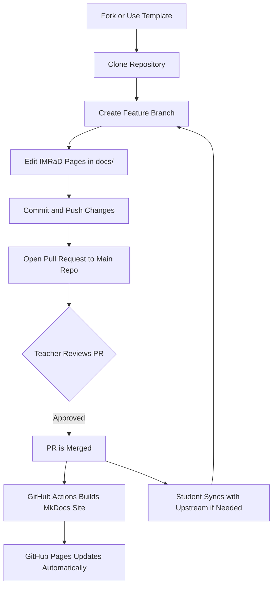

# 📘 Research IMRaD Template (Markdown + MkDocs)

Welcome to the **Research IMRaD Template** — a clean, modular, and GitHub-friendly way to write your academic research paper using:

- **Markdown** for writing  
- **MkDocs + Material theme** for documentation  
- **GitHub + GitHub Pages** for version control and publishing  

This template follows the **IMRaD structure**:

- **I**ntroduction  
- **M**ethods  
- **R**esults  
- **A**nd  
- **D**iscussion  

---

# 📦 How to Use This Repository as a Template

This repository has been configured as a **Template Repository** on GitHub.

If you are a student starting your research project, **DO NOT fork this repo**.  
Instead, follow these steps:

### ✅ 1. Click the **“Use this template”** button at the top of the repository

This creates a **new repository under your GitHub account** with the same files and structure.

### ✅ 2. Name your repository

Examples:

- `imrad-juan-dela-cruz`
- `research-maricon-santos`
- `group5-ai-research`

Choose **Public** or **Private** depending on instructor requirements.

### ✅ 3. Clone your newly created repository

```bash
git clone https://github.com/<your-username>/<your-repo>.git
```

### ✅ 4. Start editing the Markdown files inside the `docs/` directory

After writing:

```bash
git add .
git commit -m "Add introduction section"
git push
```

---

# 📁 Repository Structure

Your research content lives inside the `docs/` directory:

```
docs/
│
├── index.md
├── title-page.md
├── abstract.md
│
├── introduction/
│   ├── background.md
│   ├── research-questions.md
│   └── significance.md
│
├── methods/
│   ├── research-design.md
│   ├── participants-and-data.md
│   ├── data-collection.md
│   └── data-analysis.md
│
├── results/
│   ├── findings.md
│   └── tables-and-figures.md
│
├── discussion/
│   ├── interpretation.md
│   ├── limitations.md
│   └── recommendations.md
│
├── conclusion.md
├── references.md
│
├── appendices/
│   ├── questionnaire.md
│   └── supplementary-data.md
│
├── img/
└── src/
```

This layout ensures:

✔ Organized academic structure  
✔ Clean separation of each major section  
✔ Good maintainability  
✔ Compatibility with MkDocs navigation  

---

# 🧩 Requirements

Install MkDocs and the Material theme:

```bash
pip install mkdocs mkdocs-material
```

---

# ▶️ Local Preview

```bash
mkdocs serve
```

Open:

```
http://127.0.0.1:8000/
```

---

# 🌐 How to Enable GitHub Pages (Publishing Your Site)

This project is designed to be published online using **GitHub Pages** and **MkDocs**.

---

## ✅ 1. Push your repository to GitHub

If you haven’t yet:

```bash
git add .
git commit -m "Initial commit"
git push
```

---

## ✅ 2. Automatic Deployment (Recommended)

This template includes a **GitHub Actions workflow** that automatically deploys your MkDocs site **whenever a Pull Request is merged into the `main` branch**.

The workflow will:

1. Build your MkDocs site  
2. Push the output to the `gh-pages` branch  
3. Update your GitHub Pages website  

---

## ✅ 3. One-Time Setup on GitHub Pages

After the first deployment:

1. Go to **Settings**
2. Click **Pages**
3. Under *Build and Deployment*:
   - **Source:** Deploy from a branch  
   - **Branch:** `gh-pages`  
   - **Folder:** `/ (root)`
4. Click **Save**

Your live research website will be available at:

```
https://<username>.github.io/<repository-name>/
```

Example:

```
https://kinev10.github.io/research-imrad-template/
```

---

# 🔄 Updating Your Repository When the Template Is Updated

Repos created from templates **do not auto-sync**, but you can pull updates:

### Add upstream (ONE TIME ONLY)

```bash
git remote add upstream https://github.com/Kinev10/research-imrad-template.git
```

### Sync anytime

```bash
git pull upstream main
```

---

# 🤝 Contribution Guidelines (For Students)

Follow this workflow for clean research writing:

---

## 1️⃣ Create a Feature Branch

```bash
git checkout -b feature/<your-topic>
```

Examples:

- `feature/update-background`
- `feature/add-methods-subsection`
- `fix/grammar-in-results`

---

## 2️⃣ Write Clear Commit Messages

```
feat: add data-collection subsection
fix: correct formatting in abstract
docs: update introduction overview
```

---

## 3️⃣ Keep PRs Small  
Don’t mix unrelated edits.

---

## 4️⃣ Open a Pull Request

1. Push your branch  
2. Click **Compare & Pull Request**  
3. Write a clear description  
4. Submit  

---

## 5️⃣ Sync Before Working Again

```bash
git pull upstream main
```

---

# 🔄 Student Workflow Diagram



---

# ✍️ Editing Your Research Paper

Modify content in:

```
docs/
```

Images:

```
docs/img/
```

Source code, scripts, datasets:

```
docs/src/
```

---

# 🎉 You're Ready!

You now have a complete **IMRaD Research Template** with:

✔ Organized academic structure  
✔ Markdown-based writing  
✔ Auto-validation & auto-deployment  
✔ Template-based student workflow  
✔ Optional upstream sync  
✔ Beautiful GitHub Pages output  
✔ Visual workflow diagram  

