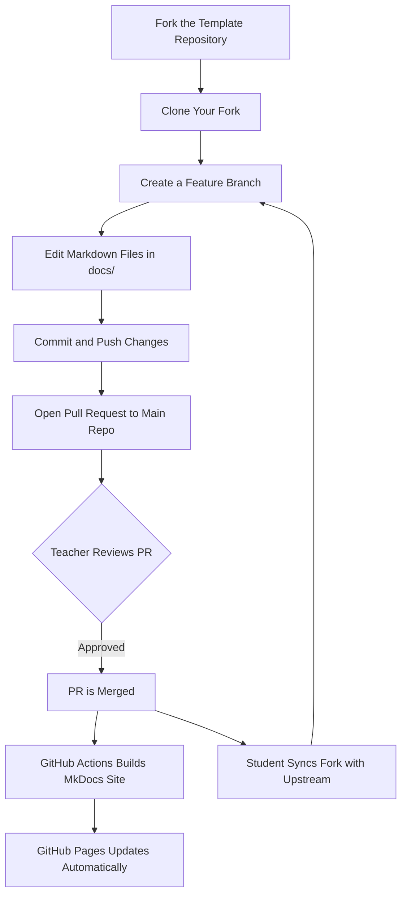

# 📘 Research IMRaD Template (Markdown + MkDocs)

Welcome to the **Research IMRaD Template** — a clean, modular, and GitHub-friendly way to write your academic research paper using:

- **Markdown** for writing  
- **MkDocs + Material theme** for documentation  
- **GitHub + GitHub Pages** for version control and publishing  

This template follows the **IMRaD structure**:

- **I**ntroduction  
- **M**ethods  
- **R**esults  
- **A**nd  
- **D**iscussion  

---

## 📁 Repository Structure

```
docs/
│
├── index.md
├── title-page.md
├── abstract.md
│
├── introduction/
│   ├── background.md
│   ├── research-questions.md
│   └── significance.md
│
├── methods/
│   ├── research-design.md
│   ├── participants-and-data.md
│   ├── data-collection.md
│   └── data-analysis.md
│
├── results/
│   ├── findings.md
│   └── tables-and-figures.md
│
├── discussion/
│   ├── interpretation.md
│   ├── limitations.md
│   └── recommendations.md
│
├── conclusion.md
├── references.md
│
├── appendices/
│   ├── questionnaire.md
│   └── supplementary-data.md
│
├── img/
└── src/
```

All research pages are written in **Markdown (.md)** files and organized by section.

---

## 🧩 Requirements

Install MkDocs and the Material theme:

```bash
pip install mkdocs mkdocs-material
```

---

## ▶️ Local Preview

To preview your research website locally:

```bash
mkdocs serve
```

Then open:

```
http://127.0.0.1:8000/
```

---

# 🌐 How to Enable GitHub Pages (Publishing Your Site)

This project is designed to be published online using **GitHub Pages** and **MkDocs**.

---

## ✅ 1. Push your repository to GitHub

If you haven’t yet:

```bash
git add .
git commit -m "Initial commit"
git push
```

---

## ✅ 2. Automatic Deployment (Recommended)

This template includes a **GitHub Actions workflow** that automatically deploys your MkDocs site **whenever a Pull Request is merged into the `main` branch**.

The workflow will:

1. Build your MkDocs site  
2. Push the output to the `gh-pages` branch  
3. Update your GitHub Pages website  

---

## ✅ 3. One-Time Setup on GitHub Pages

After the first deployment:

1. Go to **Settings**
2. Click **Pages**
3. Under *Build and Deployment*:
   - **Source:** Deploy from a branch  
   - **Branch:** `gh-pages`  
   - **Folder:** `/ (root)`
4. Click **Save**

Your live research website will be available at:

```
https://<username>.github.io/<repository-name>/
```

Example:

```
https://kinev10.github.io/research-imrad-template/
```

---

# 🔄 Updating Your Fork When the Teacher Updates the Template

When you fork this repository, you receive a **copy**.  
If the teacher updates the original template, your fork does **not** automatically update.

You must manually sync it using one of the methods below.

---

## 🅰️ Option A — GitHub UI (Easiest)

1. Open your fork on GitHub  
2. Click **Sync fork** or **Fetch upstream**  
3. Click **Update branch**

---

## 🅱️ Option B — Git Command Line (Recommended for Developers)

Run these commands inside your forked repository:

### Add the teacher’s repo as an upstream remote (ONE TIME ONLY):

```bash
git remote add upstream https://github.com/Kinev10/research-imrad-template.git
```

### Pull updates anytime you want to sync:

```bash
git pull upstream main
```

---

# 🤝 Contribution Guidelines (For Students)

This repository follows a structured contribution workflow.

---

## 📌 1. Create a Feature Branch Before Working

```bash
git checkout -b feature/<your-topic>
```

Examples:

- `feature/add-introduction`
- `feature/update-methods`
- `fix/typo-in-results`

---

## 📌 2. Follow Clear Commit Messages

Use conventional commit styles:

```
feat: add background of the study
fix: correct grammar in discussion section
docs: update abstract content
refactor: rewrite methods subsection
```

---

## 📌 3. Keep PRs Small & Focused  
Avoid mixing many unrelated edits.

---

## 📌 4. Open a Pull Request (PR)

1. Push your branch  
2. Click **Compare & Pull Request**  
3. Write a clear description  
4. Submit  

---

## 📌 5. Update Your Fork Before Starting New Work

```bash
git pull upstream main
```

This prevents merge conflicts.

---

## 📌 6. After Your PR Is Merged

- Your changes enter the main project  
- GitHub Pages **auto-updates**  
- You may safely delete your branch  

---

# 🔄 Student Workflow Diagram



---

# 🎉 You’re Ready!

You now have a complete IMRaD research repository with:

✔ GitHub version control  
✔ Organized Markdown pages  
✔ Auto-built MkDocs site  
✔ Auto-deployment to GitHub Pages  
✔ Contribution workflow for students  
✔ Fork syncing instructions  
✔ Visual workflow diagram  

